#  Дипломная работа по профессии «Системный администратор» FSYS-19 Мусиенко Александр  
  
## Задача
Ключевая задача — разработать отказоустойчивую инфраструктуру для сайта, включающую мониторинг, сбор логов и резервное копирование основных данных. Инфраструктура должна размещаться в [Yandex Cloud](https://cloud.yandex.com/) и отвечать минимальным стандартам безопасности: запрещается выкладывать токен от облака в git. Используйте [инструкцию](https://cloud.yandex.ru/docs/tutorials/infrastructure-management/terraform-quickstart#get-credentials).  

[Полное задание к дипломной работе:]{https://github.com/Alexandrmw/Diplom-FSYS19/blob/main/Task.md#%D0%B7%D0%B0%D0%B4%D0%B0%D1%87%D0%B0)  

  
## Доступ к сайту http://158.160.131.165/  

## Доступ к Zabbix http://51.250.3.119/
Логин:   admin  
Пароль:  zabbix  

## Доступ к Elastic http://158.160.113.172:5601/  
---
---
---
# Подготовка к развёртке

## Для развёртки потребуется:

- скачать репозитарий

- Прописать данные облака: token, cloud_id, folder_id  
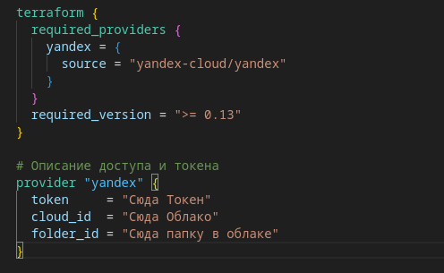

- сгенерировать ключи в папку */terraform/keys/* командой **ssh-keygen** и прописать ключи в файл */terraform/meta.yaml*
 
- Потребуются установочные пакеты elasticsearch, filebeat, kibana
Можно взять на сайте [Yandex зеркало](https://mirror.yandex.ru/mirrors/elastic/)
Пакеты положить в папку */distribute*, если в другую, то адрес надо поменять */ansible/elk/vars.yml*
Необходимо взять одну версию, номер версии прописать в файле */ansible/elk/vars.yml*


# Развёртка
---
---
---
## Развёртка осуществляется терраформом находясь в папке дистрибутива развернуть командой: **terraform apply**  

## Разворачивается за 5-8 минут   

- Успешная развёртка окончится выдачей назначенных ip адресов.   

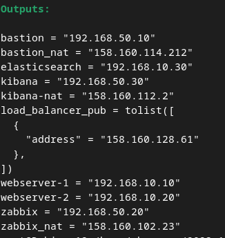   

В Консоли яндекс клауда развернутся следующие сервисы:  

  
  
-- одна сеть **bastion-network**  
-- две подсети **bastion-internal-segment** и **bastion-external-segment**  
-- Балансировщик **alb-lb** с роутером **web-servers-router**, целевой группой **tg-web**  
-- группы безопасности 10 штук  

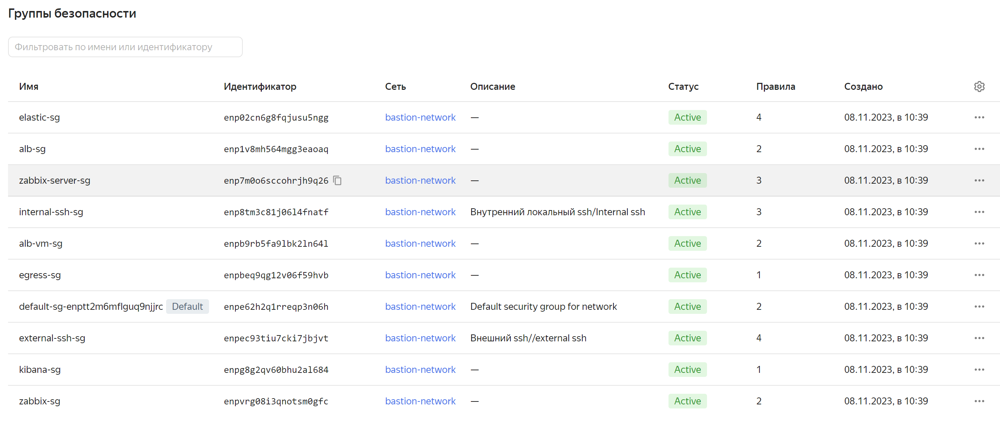  

-- развернётся 6 виртуальных машин:   

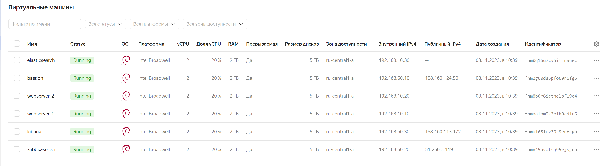   
  
-- снимки дисков осуществляются по расписанию (файл /terraform/snapshot.tf)  

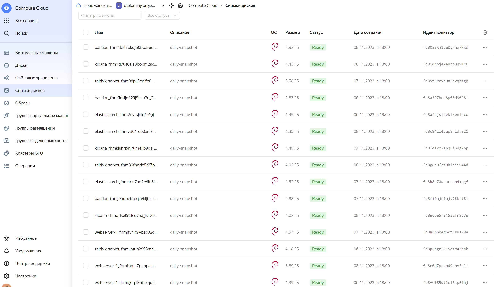   

Машины выполнены прерываемыми

```yaml

  scheduling_policy {
    preemptible = true
  }
```

## Донастройка осуществляется ansibl-ом из папки ansible:  
  
- инвенторка формируется терраформом на стадии развёртки. /ansible/hosts.ini  
  
- Также в папке лежит конфиг /ansible/ansible.cfg  
  
- Прописываем ранее сгенерированный ssh-ключ на хостовую машину: *ssh-add ../terraform/keys/id_rsa*  
  
- Далее пробуем пинговать машины из списка хостов: *ansible all -m ping*  
На запрос отпечатка отвечаем **yes**  
  
- Устанавливаем пакеты на хостовую машину:  
*ansible-playbook first_playbook.yml*  
  
- Далее устанавливаем необходимые пакеты и переносим сайт командой  
*ansible-playbook sekond_playbook.yml --vault-password-file pass -v*

# В результате
## установится сайт: 

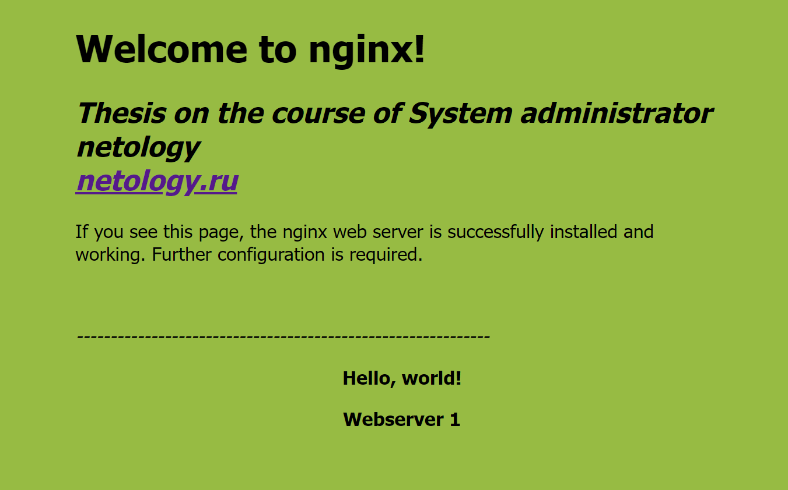  
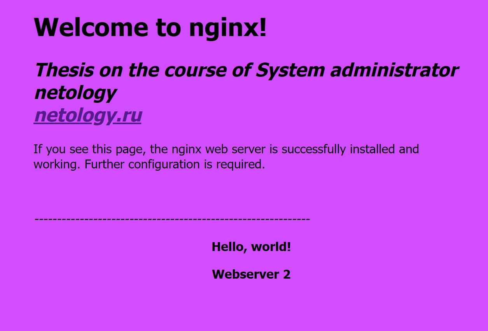  
  
## Развернётся забикс на забикс сервер, на остальные машины установятся агенты:  
  
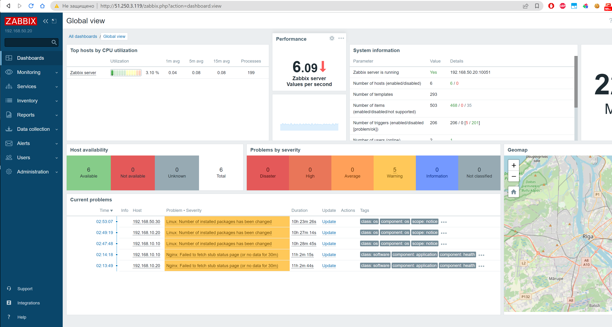   

И будет собираться метрика  
  
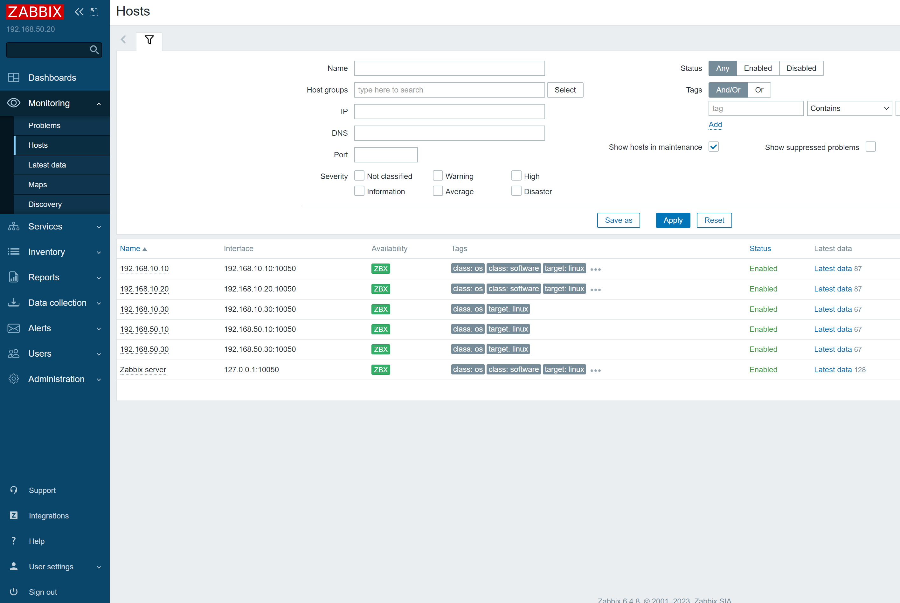  

## Развернётся Elasticsearch и kibana

## Filebeat с вэбсерверов отправляет метрику

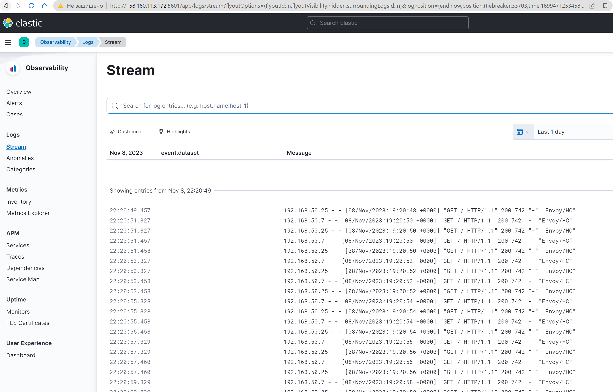  

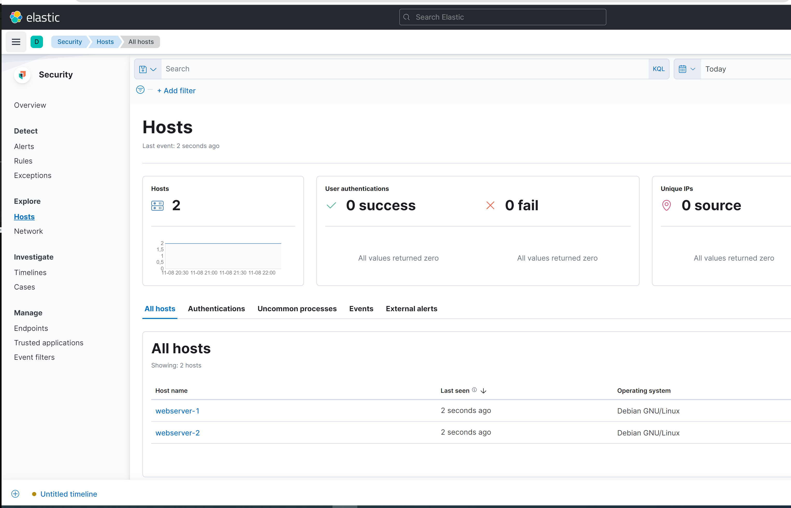  
